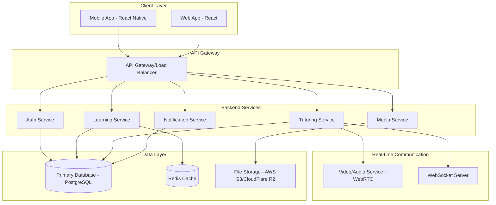

# Design Document

## Overview

The Nigerian Language Learning App is a cross-platform (mobile and web) application focused on teaching Yoruba language through gamified lessons and 1-on-1 tutoring. The system employs a mobile-first responsive design with offline capabilities, real-time video/audio communication, and a comprehensive gamification system to maximize user engagement and learning outcomes.

### Key Design Principles

- **Mobile-First**: Optimized for mobile devices with responsive web design
- **Offline-Capable**: Core learning functionality available without internet
- **Culturally Authentic**: Content created and validated by native Yoruba speakers
- **Gamification-Driven**: Points, badges, streaks, and achievements to maintain engagement
- **Scalable Architecture**: Designed to support future expansion to other Nigerian languages

## Architecture

### System Architecture



### Technology Stack

**Frontend:**
- Mobile: React Native with Expo for cross-platform development
- Web: React with TypeScript for type safety
- State Management: Redux Toolkit with RTK Query for API calls
- UI Framework: NativeBase (mobile) / Chakra UI (web) for consistent design
- Offline Storage: SQLite (mobile) / IndexedDB (web)

**Backend:**
- Runtime: Node.js with Express.js framework
- Language: TypeScript for type safety
- Database: PostgreSQL for relational data, Redis for caching and sessions
- File Storage: AWS S3 or CloudFlare R2 for media files
- Real-time: Socket.io for WebSocket connections, WebRTC for video/audio

**Infrastructure:**
- Containerization: Docker for consistent deployment
- Cloud Platform: AWS or Vercel for hosting
- CDN: CloudFlare for global content delivery
- Monitoring: Sentry for error tracking, Analytics for user behavior

## Components and Interfaces

### Core Components

#### 1. Authentication System
- **User Registration/Login**: Email/phone-based authentication with OTP verification
- **Profile Management**: User preferences, learning goals, progress tracking
- **Role-Based Access**: Separate interfaces for learners and tutors

#### 2. Learning Engine
- **Lesson Management**: Structured curriculum with progressive difficulty
- **Game Modules**: Interactive exercises (matching, pronunciation, sentence building)
- **Progress Tracking**: Completion rates, accuracy scores, time spent
- **Achievement System**: Points, badges, streaks, leaderboards

#### 3. Content Management System
- **Yoruba Content**: Vocabulary, grammar rules, cultural context
- **Media Assets**: Audio recordings, images, pronunciation guides
- **Cultural Integration**: Traditional stories, proverbs, cultural explanations
- **Content Versioning**: Updates and improvements to learning materials

#### 4. Tutoring Platform
- **Tutor Profiles**: Credentials, availability, ratings, specializations
- **Scheduling System**: Calendar integration, booking management
- **Video/Audio Calling**: WebRTC-based real-time communication
- **Session Management**: Recording, notes, feedback, payment processing

#### 5. Offline System
- **Content Synchronization**: Download lessons for offline access
- **Progress Sync**: Queue offline progress for upload when online
- **Conflict Resolution**: Handle data conflicts between offline and online states

### API Design

#### RESTful Endpoints

```
Authentication:
POST /api/auth/register
POST /api/auth/login
POST /api/auth/refresh
DELETE /api/auth/logout

User Management:
GET /api/users/profile
PUT /api/users/profile
GET /api/users/progress
POST /api/users/achievements

Learning Content:
GET /api/lessons
GET /api/lessons/:id
POST /api/lessons/:id/complete
GET /api/exercises/:lessonId
POST /api/exercises/:id/submit

Tutoring:
GET /api/tutors
GET /api/tutors/:id
POST /api/sessions/book
GET /api/sessions/my-sessions
PUT /api/sessions/:id/feedback

Media:
GET /api/media/audio/:id
GET /api/media/images/:id
POST /api/media/upload
```

#### WebSocket Events

```
Connection Management:
- connect
- disconnect
- authenticate

Tutoring Sessions:
- join-session
- leave-session
- session-message
- session-ended

Real-time Updates:
- progress-updated
- achievement-unlocked
- tutor-available
```

## Data Models

### User Model
```typescript
interface User {
  id: string;
  email: string;
  phone?: string;
  name: string;
  role: 'learner' | 'tutor' | 'admin';
  profileImage?: string;
  preferences: UserPreferences;
  createdAt: Date;
  updatedAt: Date;
}

interface UserPreferences {
  learningGoal: 'basic' | 'conversational' | 'fluent';
  dailyGoalMinutes: number;
  notificationsEnabled: boolean;
  preferredStudyTime: string;
}
```

### Learning Progress Model
```typescript
interface UserProgress {
  userId: string;
  currentLevel: number;
  totalPoints: number;
  streakDays: number;
  lessonsCompleted: number;
  totalStudyTime: number;
  achievements: Achievement[];
  lastActiveDate: Date;
}

interface LessonProgress {
  userId: string;
  lessonId: string;
  completionPercentage: number;
  accuracy: number;
  timeSpent: number;
  completedAt?: Date;
}
```

### Content Models
```typescript
interface Lesson {
  id: string;
  title: string;
  description: string;
  level: number;
  order: number;
  type: 'vocabulary' | 'grammar' | 'conversation' | 'culture';
  exercises: Exercise[];
  culturalContext?: string;
  estimatedDuration: number;
}

interface Exercise {
  id: string;
  lessonId: string;
  type: 'matching' | 'pronunciation' | 'translation' | 'listening';
  question: string;
  options?: string[];
  correctAnswer: string;
  audioUrl?: string;
  imageUrl?: string;
  points: number;
}
```

### Tutoring Models
```typescript
interface Tutor {
  id: string;
  userId: string;
  bio: string;
  credentials: string[];
  specializations: string[];
  hourlyRate: number;
  rating: number;
  totalSessions: number;
  availability: TimeSlot[];
  isVerified: boolean;
}

interface TutoringSession {
  id: string;
  tutorId: string;
  learnerId: string;
  scheduledAt: Date;
  duration: number;
  status: 'scheduled' | 'in-progress' | 'completed' | 'cancelled';
  sessionNotes?: string;
  rating?: number;
  feedback?: string;
  recordingUrl?: string;
}
```

## Error Handling

### Client-Side Error Handling
- **Network Errors**: Graceful degradation to offline mode
- **Validation Errors**: Real-time form validation with clear error messages
- **Authentication Errors**: Automatic token refresh, redirect to login when needed
- **Media Loading Errors**: Fallback content, retry mechanisms

### Server-Side Error Handling
- **Input Validation**: Comprehensive request validation using Joi or Zod
- **Database Errors**: Connection pooling, transaction rollbacks, retry logic
- **External Service Failures**: Circuit breaker pattern for third-party APIs
- **Rate Limiting**: Prevent abuse with request throttling

### Error Response Format
```typescript
interface ErrorResponse {
  success: false;
  error: {
    code: string;
    message: string;
    details?: any;
  };
  timestamp: string;
  requestId: string;
}
```

## Testing Strategy

### Frontend Testing
- **Unit Tests**: Jest + React Testing Library for component testing
- **Integration Tests**: Test user flows and API integration
- **E2E Tests**: Playwright for critical user journeys
- **Performance Tests**: Lighthouse CI for web performance monitoring

### Backend Testing
- **Unit Tests**: Jest for service and utility function testing
- **Integration Tests**: Supertest for API endpoint testing
- **Database Tests**: Test database operations with test database
- **Load Tests**: Artillery.js for performance under load

### Mobile Testing
- **Device Testing**: Test on various Android/iOS devices and screen sizes
- **Offline Testing**: Verify offline functionality works correctly
- **Performance Testing**: Monitor app startup time, memory usage
- **Accessibility Testing**: Ensure app is accessible to users with disabilities

### Testing Data
- **Seed Data**: Comprehensive test data for Yoruba content
- **Mock Services**: Mock external services for reliable testing
- **Test Users**: Different user types (learners, tutors, admins) for role-based testing

## Security Considerations

### Authentication & Authorization
- **JWT Tokens**: Short-lived access tokens with refresh token rotation
- **Role-Based Access Control**: Granular permissions for different user types
- **Multi-Factor Authentication**: Optional 2FA for enhanced security
- **Session Management**: Secure session handling with proper timeout

### Data Protection
- **Encryption**: TLS 1.3 for data in transit, AES-256 for sensitive data at rest
- **Input Sanitization**: Prevent XSS, SQL injection, and other attacks
- **File Upload Security**: Virus scanning, file type validation, size limits
- **Privacy Compliance**: GDPR-compliant data handling and user consent

### Infrastructure Security
- **API Rate Limiting**: Prevent abuse and DDoS attacks
- **CORS Configuration**: Proper cross-origin resource sharing setup
- **Security Headers**: Implement security headers (CSP, HSTS, etc.)
- **Monitoring**: Real-time security monitoring and alerting

## Performance Optimization

### Frontend Performance
- **Code Splitting**: Lazy load components and routes
- **Image Optimization**: WebP format, responsive images, lazy loading
- **Caching Strategy**: Service worker for offline caching, CDN for static assets
- **Bundle Optimization**: Tree shaking, minification, compression

### Backend Performance
- **Database Optimization**: Proper indexing, query optimization, connection pooling
- **Caching Layer**: Redis for frequently accessed data
- **API Optimization**: Pagination, field selection, response compression
- **Media Delivery**: CDN for audio/video files, adaptive streaming

### Mobile Performance
- **App Size**: Minimize bundle size, use dynamic imports
- **Battery Optimization**: Efficient background processing, optimized animations
- **Memory Management**: Proper cleanup of resources, image caching
- **Startup Time**: Optimize app initialization and first screen load